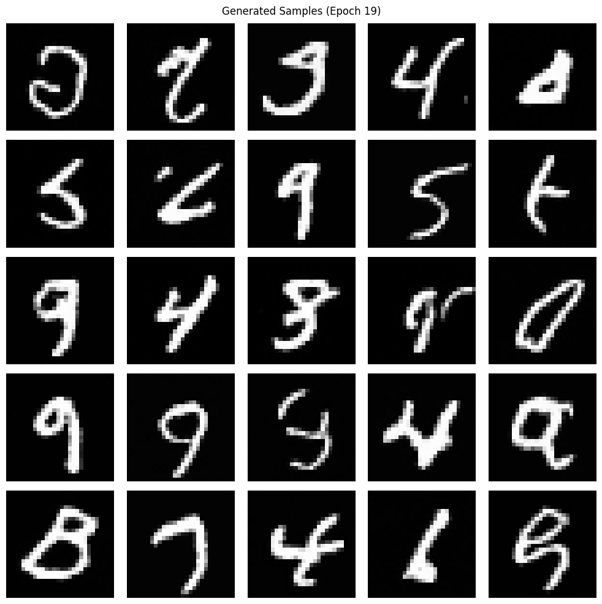
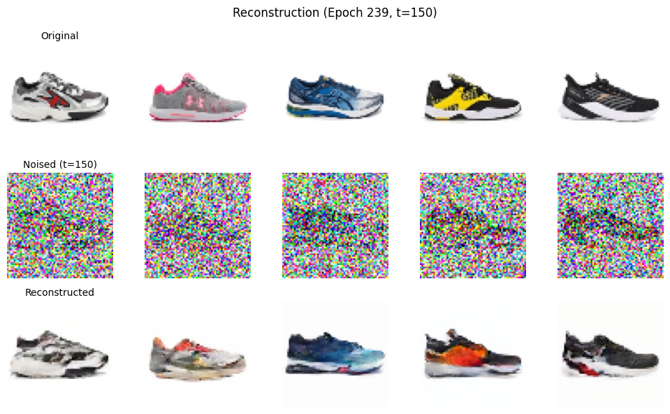
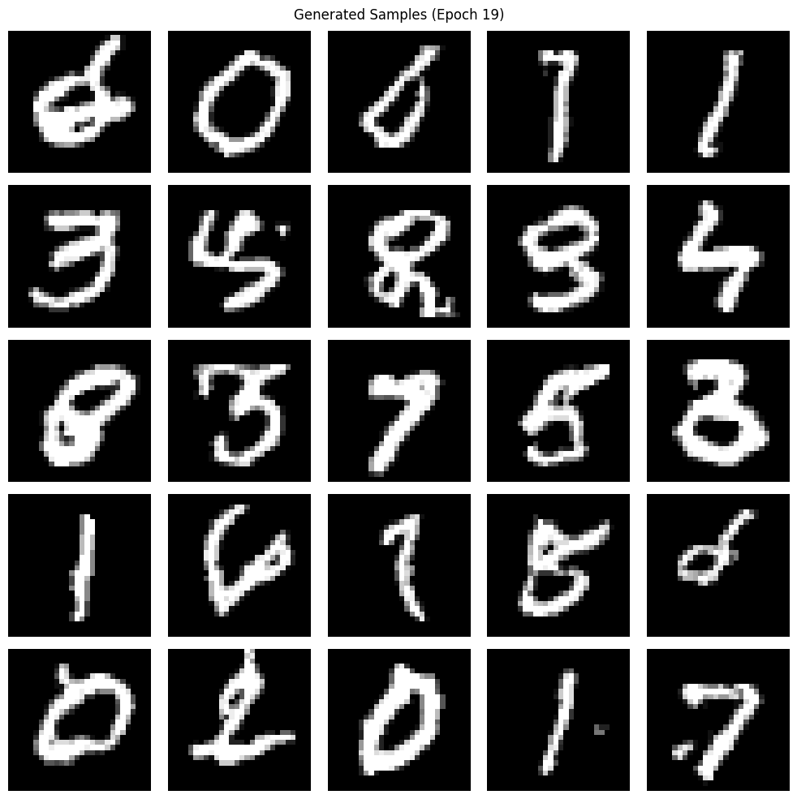

# 01 — Diffusion ✨

This module covers **diffusion models** in both **continuous** and **discrete** settings.

## Results (examples)

### DDPM (MNIST) — unconditional samples

### DDPM (Sneakers) — reconstruction from a noised image

### D3PM (MNIST) — unconditional samples

## Notebooks

- **`DDPM_MNIST.ipynb`**: train a **continuous DDPM** on **MNIST** (forward noising, reverse denoising, sampling, and visualizations; includes linear + cosine noise schedules).
- **`DDPM_MNIST_trained.ipynb`**: the same MNIST DDPM workflow, but oriented around **trained runs / saved artifacts** (e.g., sampling/reconstruction figures and checkpoints under `data/experiments/`).
- **`DDPM_Sneakers.ipynb`**: train a **continuous DDPM** on the **Sneakers** dataset using a **U-Net w/ attention** denoiser (downloads data in-notebook).
- **`DDPM_Sneakers_trained.ipynb`**: load/use a **trained Sneakers DDPM** (incl. EMA weights) and generate/reconstruct examples.
- **`D3PM_MNIST.ipynb`**: train a **discrete D3PM** on **MNIST** by **quantizing pixels into categorical tokens** (e.g., \(K=16\)); explores discrete forward processes (uniform / discrete-Gaussian / absorbing transitions) and trains the reverse model.

## References 📚

- **DDPM**: Ho et al., *Denoising Diffusion Probabilistic Models* (2020). `https://arxiv.org/abs/2006.11239`
- **Cosine noise schedule**: Nichol & Dhariwal, *Improved Denoising Diffusion Probabilistic Models* (2021). `https://arxiv.org/abs/2102.09672`
- **D3PM**: Austin et al., *Structured Denoising Diffusion Models in Discrete State-Spaces* (2021). `https://arxiv.org/abs/2107.03006`

